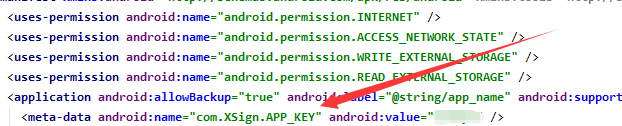
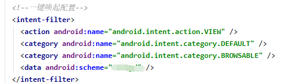
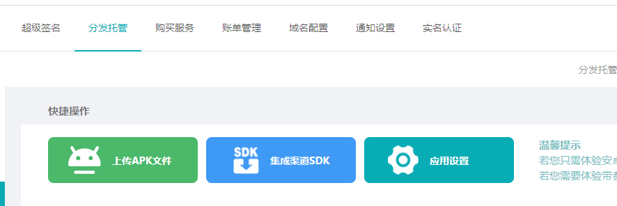

# xsigninstall-unity-sdk
 方便 unity 集成使用 xsigninstall
	
## 导入 xsigninstall.unitypackage
右击 `Assets` ，选择 `Import Package` 中的 `Custom Package...`    

在文件选择框中选中 `xsigninstall.unitypackage`，导入所有文件

将 `Assets/Plugins/XSignInstall` 下的 `XSignInstall.prefab` 拖入对应的场景中使用 xsigninstall 实现业务逻辑

## 平台配置
#### 请根据`使用指南`来做对应配置

### iOS 平台

_备注：  
- 如果用户使用了 `IMPL_APP_CONTROLLER_SUBCLASS` 宏生成自己的 `customAppController`,请在自己的 `customAppController` 中添加初始化方法和拉起回调方法，并删除掉 `Assets/Plugins/iOS/libs` 中的 `CustomAppController.mm` 文件；  

##### 初始化配置

在 Info.plist 文件中配置 appKey 键值对，如下：
``` xml
<key>com.XSigninstall.APP_KEY</key>
<string>XSigninstall官网后台获取应用的appkey</string>
```

#### 以下为iOS一键拉起功能相关配置
##### universal links配置（iOS9以后推荐使用）

对于iOS，为确保能正常跳转，AppID必须开启Associated Domains功能，请到[苹果开发者网站](https://developer.apple.com)，选择Certificate, Identifiers & Profiles，选择相应的AppID，开启Associated Domains。注意：当AppID重新编辑过之后，需要更新相应的mobileprovision证书。如果已经开启过Associated Domains功能，进行下面操作：  

- 在左侧导航器中点击您的项目
- 选择 `Capabilities` 标签
- 打开 `Associated Domains` 开关
- 添加 xsigninstall 官网后台中应用对应的关联域名（xsigninstall分发托管->iOS集成->应用管理->ios包管理->关联域名(Associated Domains)）

**xsigninstall完全兼容微信openSDK1.8.6以上版本的通用链接跳转功能，注意微信SDK初始化方法中，传入正确格式的universal link链接：**  

``` objc
//your_wxAppID从微信后台获取，yourAppkey从xsigninstall后台获取
[WXApi registerApp:@"your_wxAppID" universalLink:@"applinks:yourAppkey.xsigninstall.cn"];
```

微信开放平台后台Universal links配置，要和上面代码中的保持一致  

- 微信SDK更新参考[微信开放平台更新文档](https://developers.weixin.qq.com/doc/oplatform/Mobile_App/Access_Guide/iOS.html)  

##### scheme配置

在 `Info.plist` 文件中，在 `CFBundleURLTypes` 数组中添加应用对应的 `scheme`，或者在工程“TARGETS-Info-URL Types”里快速添加
（scheme的值详细获取位置：xsigninstall分发托管->iOS集成->应用管理->ios包管理->scheme）

``` xml
	<key>CFBundleURLTypes</key>
	<array>
	    <dict>
		<key>CFBundleTypeRole</key>
		<string>Editor</string>
		<key>CFBundleURLName</key>
		<string>xsigninstall</string>
		<key>CFBundleURLSchemes</key>
		<array>
		    <string>"从xsigninstall官网后台获取应用的scheme"</string>
		</array>
	    </dict>
	</array>
```

### Android 平台

##### 简单配置
将 `sample/Android` 目录中的 `AndroidManifest.xml` 文件拷贝到项目的 `Assets/Plugin/Android/` 目录下，并修改文件内容：**将 xsigninstall 为应用分配的 `appkey` 和 `scheme` 替换至相应位置**  
(scheme的值详细获取位置：xsigninstall分发托管->android集成->应用管理->android包管理->scheme)

##### 自定义配置
1. 如果项目已存在自己的 `AndroidManifest.xml` 文件，根据下图标注的内容做相应的更改
  
  

2. 如果需要使用自己的拉起 `Activity` ，可参考 `sample/Android/src` 目录中的 `MainActivity.java` 在拉起 `Activity` 的 `onCreate(Bundle savedInstanceState)` 和 `onNewIntent(Intent intent)` 中添加拉起处理代码
3. build.gradle 中dependencies 加上androidx依赖项 ：implementation 'androidx.core:core:1.1.0'

## 使用指南
### 除了`快速下载`功能，其他功能都需要先 `导入空间命令并获取实例`
使用 `XSigninstall` 之前，请先导入命名空间
``` c
using com.projectdemo.xsigninstall;
```
然后通过 `GameObject` 获取 `XSignInstall` 实例
``` c
private XSignInstall xsigninstall;
void Start () {
    xsigninstall = GameObject.Find("XSignInstall").GetComponent<XSignInstall>();
}
```

#### 1 快速下载
如果只需要快速下载功能，无需其它功能（携带参数安装、渠道统计、一键拉起），完成初始化相关工作即可

#### 2 一键拉起
##### 完成文档前面iOS和Android介绍的一键拉起相关配置

##### 获取拉起数据
``` c
public void _wakeupCallback(string result){
    Debug.Log("XSigninstall _wakeupCallback : " + result);
}

```

#### 3 携带参数安装（高级版功能）
##### 获取安装数据
在应用需要安装参数时，调用以下 api 获取由 SDK 保存的安装参数
``` c
xsigninstall.GetInstall();
```
``` c
public void _wakeupCallback(string result)
{
    Debug.Log("XSigninstall _wakeupCallback : " + result);
    
}
```

##### 4.1 注册上报
在用户注册成功后，调用接口上报注册量
``` c
xsigninstall.Register();
```

## 导出apk/api包并上传
- 代码集成完毕后，需要导出安装包上传xsigninstall后台，xsigninstall会自动完成所有的应用配置工作。  
- 上传完成后即可开始在线模拟测试，体验完整的App安装/拉起流程；待测试无误后，再完善下载配置信息。  

下面是apk包的上传界面（后台截图）：  


